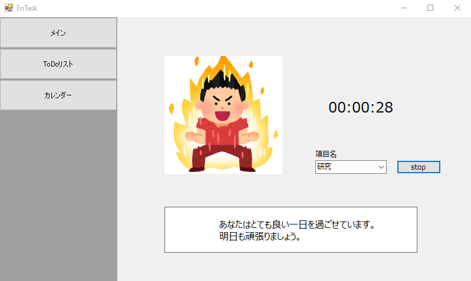

# EnTask

EnTaskは時間管理ができない人のための、Todoリストとカレンダーを連動させ、記録を残すWindows Formsアプリケーションです。

## 使い方

1. [リソース](https://github.com/sasamina3337/EnTask)から最新版のEnTaskをcloneします。
2. ダウンロードしたファイルをVisual Studio Cominityでコンパイルし、`EnTask.exe`を実行します。その際に、[GoogleApI](https://console.cloud.google.com/)からグーグルカレンダーAPIを登録し、OAuth認証しそのjsonファイルをclient_secret.jsonとリネームしてexeファイルと同じディレクトリ内に配置してください。
3. メインフォームが表示されます。Googleアカウントを用いて認証を行ってください。
4. まず、初めにTodoリストで項目と1日の目標時間を決めてください。カテゴリ登録することで分類分けすることが可能です。
5. 項目を選択し、カウント開始ボタンを押すと、カウントが開始されます。トップ画面の画像は1日ごとの仕事量のタスク量に応じて変化します。カウントを停止するには、同じボタンをもう一度押します。
6. カウントを停止すると、カウントした時間と項目名がGoogleカレンダーに記録され、登録、更新、削除をクライアント側で行うことができます。

## スクリーンショット

